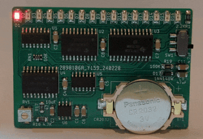

# "Supercar" Larson Scanner

## Introduction

"Supercar" is the (stupid) italian name for the [Knight Rider](https://en.wikipedia.org/wiki/Knight_Rider_(1982_TV_series)) TV series.
In that series, the iconic car KITT sports a red light going back and forth under the hood. That effect is called "[Larson](https://en.wikipedia.org/wiki/Glen_A._Larson) scanner".

This board implements a "Larson scanner" with regulable speed using a 555 timer and a few 74' CMOS logic ICs (two latches, a full adder, a demux and a 4x 2-in xor gate).
It's powered by a CR2032 coin cell battery.

The circuit is quite simple to understand and a good exercise on SMD hand-soldering.

### Disclaimer

I take NO responsibility for what happens if you decide to build and use this card. But You're encourauged to take what you deem fit from this, and use it in your projects!

## Verilog simulation

You can find a verilog implementation of the circuit under the `supercar_verilog` directory, complete with a testbench.

## Bill of Materials

**TODO**

## Required Fixes

### Rev. 1

* Pin 4 of the RN1 resistor network is unconnected and should be connected to +3.3V. Pin 16 of U1 is a good spot.
